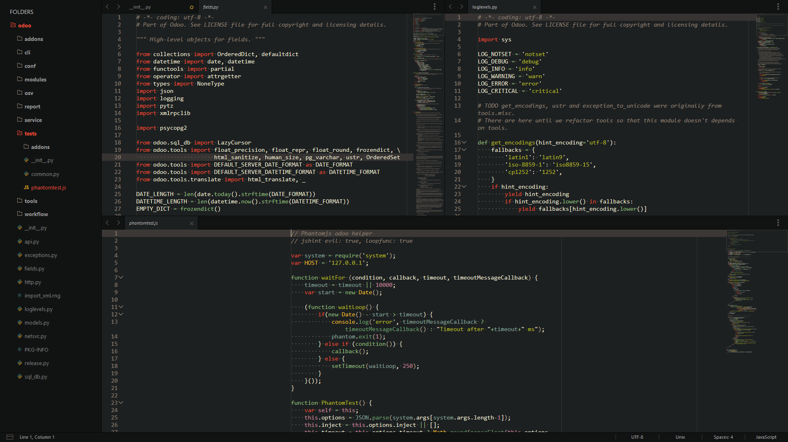

# SUBLIME ENVIROMENT SETTINGS.

## INSTALLED PACKAGES.
- Gruvbox
- TabsExtra
- More Layouts
- SideBarEnhancements

## VISUAL SETTINGS.
- GRUVBOX theme !
- Bold folder labels.
- Draw minimap border.
- Show tab close button.
- Scroll past on the end.
- Always view whitespaces.
- Highlight modified tabs.
- Highlight for actual line.
- Better windows font render.
- Animations on tree and more.
- Disabled fold button's fade.
- Draw indent guides (actives).
- Always show minimap viewport.
- 2px caret and phase animation.
- Word wrap by default on 80chars.
- Center the text on the app frame.
- View actual EOF line on StatusBar.
- View lines on DistractionFree mode.
- Visual rulers at 80chars and 120chars.
- View UTF-8 or prefered encoding on StatusBar.
- View gutter (with 4px margin) and line numbers.

## NOT-VISUAL SETTINGS.
- Hot exit.
- Save on focus lost.
- Disable spellcheck.
- Never prompt for file reload.
- Ensure newline at EOF on save.
- Don't lets copy empty selection.
- Trim trailing whitespaces on save.
- Don't close window on last tab's close.
- A little bit quicker scroll. (1.0 to 1.2)
- Auto find in selection when have selected a text-block.
- Use tabs insted of spaces, also tab stops with 4p size.
- Auto indent, to bracket and on smart way; also detect on paste.

## KEYMAP SETTINGS.
- ctrl+d            =   delete line.
- ctrl+alt+space    =   toggle SideBar.
- ctrl+alt+c        =   sublime's console.
- ctrl+shift+v      =   paste_from_history.
- ctrl+enter        =   show command palette.
- ctrl+right        =   move to the last char of the line.
- ctrl+left         =   move to the first char of the line.
- shift+backspace   =   right delete (like 'supr' or 'del' keys).
- ctrl+t            =   find and new cursor select with the next under caret word match (default: ctrl+d).
